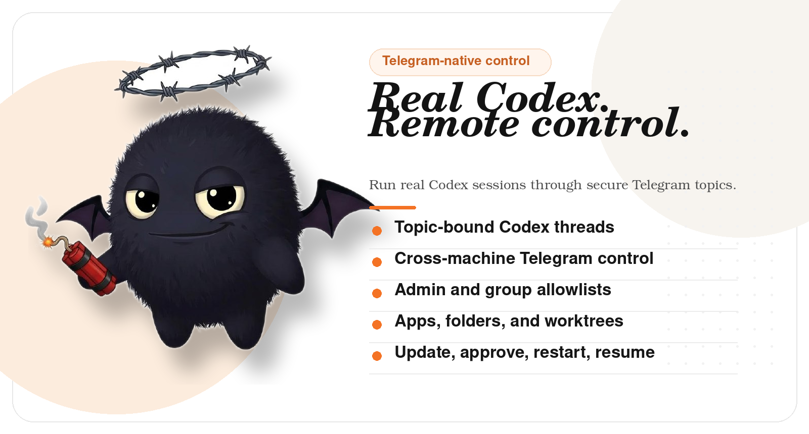

# CoCo: Orchestrate Codex across machines through Telegram.

<p align="center">
  
</p>

<p align="center">
  <strong>Telegram-native control bot for real OpenAI Codex sessions.</strong>
</p>

<p align="center">
  
  
  
</p>

<p align="center">
  <a href="#install">Install</a> ·
  <a href="#fastest-secure-setup">Setup</a> ·
  <a href="#what-it-actually-does">How It Works</a> ·
  <a href="#faq">FAQ</a> ·
  <a href="#primary-commands">Commands</a> ·
  <a href="#additional-docs">Docs</a> ·
  <a href="CONTRIBUTING.md">Contributing</a>
</p>

## Install

Copy, paste, run:

```bash
curl -fsSL https://raw.githubusercontent.com/pcopu/coco/main/install.sh | bash
```

Then start CoCo:

```bash
coco
```

## Fastest Secure Setup

Do **not** add the CoCo bot to a group before the allowlist is on the machine.
The secure default is: collect the IDs first, write the config locally, then
invite the bot only after CoCo is locked to the right admin user and
supergroup.

### 1. Create the Telegram bot in BotFather

In Telegram, talk to [@BotFather](https://t.me/BotFather):

1. Run `/newbot` and copy the bot token.
2. Run `/setprivacy` and choose **Disable** so CoCo can read normal topic messages during setup and in any group where you want free-form topic chat.
3. Open **Bot Settings** and enable **Threaded Mode**.
4. After setup is complete, go back to `/setprivacy` and choose **Enable** if you want the stricter default where CoCo only sees commands, replies, and `@mentions`. Leave privacy **Disable** only if you want CoCo to keep reading normal topic messages.

### 2. Create the target supergroup and turn on topics

1. Create the supergroup where CoCo will operate.
2. In the group settings, enable **Topics**.

### 3. Collect the IDs before CoCo ever joins the group

1. DM [@userinfobot](https://t.me/userinfobot) and copy your numeric Telegram user ID.
2. Add [@RawDataBot](https://t.me/RawDataBot) to the target supergroup temporarily.
3. Send one message in the supergroup.
4. Copy the `chat.id` value from RawDataBot's reply. It should start with `-100`.
5. Remove RawDataBot from the supergroup.

### 4. Bootstrap CoCo on the machine

Run this on the machine where CoCo will run:

```bash
coco init \
  --bot-token 123456:ABCDEF_your_bot_token \
  --admin-user 123456789 \
  --group-id -1001234567890
```

Notes:

- Repeat `--group-id` to pre-approve multiple supergroups.
- `coco init` writes `~/.coco/.env` and `~/.coco/allowed_users_meta.json`.
- By default it requires `--group-id` so you do not accidentally start with an open group policy.

### 5. Start CoCo and add it to the approved supergroup

```bash
coco
```

Then:

1. Add your CoCo bot to the approved supergroup.
2. Promote it to admin.
3. Open a topic and send `/start` or `/folder`.

## Hardened Setup

If you want the token, allowlist, and approved groups in root-managed files
instead of `~/.coco/.env`, use the hardened bootstrap path:

```bash
sudo "$(command -v coco-admin)" bootstrap \
  --bot-token 123456:ABCDEF_your_bot_token \
  --admin-user 123456789 \
  --group-id -1001234567890
```

That writes:

- auth users to `/etc/coco/auth/auth.env`
- allowlist metadata to `/etc/coco/auth/allowed_users_meta.json`
- runtime env to `/etc/coco/coco.env`

After that, restart your CoCo service or launch `coco` with that env loaded.

## Source Install

If you prefer source installs:

```bash
git clone https://github.com/pcopu/coco.git
cd coco
uv sync
uv run coco
```

[中文文档](README_CN.md)

CoCo is a Telegram-native control bot for real Codex sessions. It binds
Telegram topics to actual Codex threads, preserves session continuity, and lets
you run, monitor, resume, and steer work away from the terminal without
inventing a fake parallel agent.

CoCo started from `ccbot`, then was rewritten into a cleaner Codex-only
overlay with app-server transport, topic-bound workflows, and CoCo-specific
runtime conventions.

## Credit

CoCo is derived from `ccbot`, which established the original Telegram
topic-to-session operating model this project builds on. The current repo keeps
that lineage while narrowing the scope to a Codex-first overlay.

## What It Actually Does

### 1. Per-topic app layer

Each Telegram topic can have its own little stack of behavior.

- Built-in app flow like `looper`
- Topic-specific skill injection
- Custom app-ish helpers from local `SKILL.md` folders
- A decent place to put the weird project glue you keep reusing

### 2. Git worktrees without turning your repo into soup

CoCo can create and manage worktrees from Telegram so you can branch off work
cleanly instead of shoving every experiment into one checkout and hoping for the
best.

### 3. Multi-machine orchestration over Tailscale

One Telegram-facing controller can route work to multiple machines.

- machine-aware `/folder`, `/resume`, and `/status`
- controller/agent split
- remote session resume and attachment relay
- stale-node peer probing before a machine is declared offline

See [doc/multi-machine-setup.md](doc/multi-machine-setup.md).

### 4. New projects on the fly, organized by Telegram topics

Telegram topics are the project switchboard.

- pick a machine
- pick a folder
- resume an old Codex session or start fresh
- keep each project in its own topic instead of one giant chat graveyard

### 5. Two-way resume using Codex's built-in resume

CoCo binds topics to real Codex threads and leans on Codex's own resume model.
That means you can move between Telegram and the host session without inventing a
fake parallel memory system.

## Why Use It

Because Codex does not stop existing when you leave your desk.

CoCo gives you:

- Telegram topics as project lanes
- queueing, approvals, status, and resume controls
- attachments back into Telegram
- worktree creation and session rebinding
- a practical way to keep multiple projects moving without babysitting one terminal

## Quick Start

### Manual config fallback

If you do not want to use `coco init`, create `~/.coco/.env` yourself:

```ini
TELEGRAM_BOT_TOKEN=your_bot_token_here
ALLOWED_USERS=your_telegram_user_id
ALLOWED_GROUP_IDS=-100your_supergroup_id
```

## FAQ

### Is CoCo a separate AI assistant?

No. CoCo is the Telegram control layer for real Codex sessions. It binds
Telegram topics to actual Codex threads instead of inventing a second memory
system.

### Do I need to add the bot to a group before setup?

No. The safer flow is to create the bot, collect your user/group IDs, run
`coco init`, and only then add the bot to the approved supergroup.

### Does CoCo work across multiple machines?

Yes. One controller can stay Telegram-facing while agent machines sit behind
Tailscale. Folder picking, resume, status, and offline notices all work across
that model.

### Can I update CoCo and Codex separately?

Yes. `/update` supports CoCo-only, Codex-only, or combined updates.

### Where does state live?

By default under `~/.coco`, with Codex session state continuing to live in
`~/.codex/sessions`.

## Additional Docs

- [System architecture](doc/architecture.md)
- [Topic architecture](doc/topic-architecture.md)
- [Message handling](doc/message-handling.md)
- [Multi-machine setup](doc/multi-machine-setup.md)
- [Telegram bot feature matrix](doc/telegram-bot-features.md)

## Primary Commands

| Command | What it does |
| --- | --- |
| `/folder` | Pick machine, folder, and prior session for this topic |
| `/resume` | Rebind this topic to an existing Codex thread |
| `/worktree` | Create/list/fold git worktrees |
| `/apps` | Configure per-topic apps and app-like helpers |
| `/looper` | Run recurring plan nudges until the work is actually done |
| `/q <text>` | Queue the next prompt behind the active run |
| `/status` | Show machine/session state |
| `/model` | Pick per-topic model and reasoning level |
| `/approvals` | Change approval mode for the bound session |

Assistant commands like `/clear`, `/compact`, `/cost`, and `/help` are forwarded to Codex.

## Shell and Agent CLI

The Telegram slash surface is mirrored by a local CLI so agents and cron jobs
can inspect or act on the currently bound topic without clicking through
Telegram UI.

Inspect the current topic:

```bash
coco topic
coco topic --json
```

Send directly to the bound topic from shell:

```bash
coco topic send --text "hello"
coco topic send --text-file /tmp/msg.md
coco topic send --text-file /tmp/msg.md --image-url https://example.com/image.jpg
coco topic send --text-file /tmp/msg.md --image-file /tmp/image.jpg
```

Notes:

- `coco topic send` requires exactly one of `--text` or `--text-file`.
- It accepts at most one image source via `--image-url` or `--image-file`.
- Text-only sends use the normal Telegram text path. Image sends are delivered as
  one photo with the text as the caption.

Drive recurring shell workflows through looper when needed:

```bash
coco looper start plans/ship.md done --every 15m
coco looper start --runner "python tools/nudge.py" --every-random 25m 75m --on-reply
```

Runner mode contract:

- exit `0` with empty stdout: no message is sent
- exit `0` with text on stdout: that text is sent to the topic
- exit nonzero: the failure is logged and the looper stays alive

## Multi-Machine Notes

The controller is the only Telegram-facing process.
Agents stay private on Tailscale.

That gives you:

- one bot identity
- multiple machines in the folder picker
- offline/recovery notices for bound topics
- remote attachment delivery (`.pdf`, `.txt`, `.md`, and common image types)
- a cleaner security model than pretending Telegram is an RPC bus

## Storage

Current default paths:

- config/state: `~/.coco`
- topic bindings: `$COCO_DIR/state.json`
- monitor offsets: `$COCO_DIR/monitor_state.json`
- node registry: `$COCO_DIR/nodes.json`
- Codex sessions: `~/.codex/sessions`

## Admin

```bash
sudo coco-admin show
sudo coco-admin add-user 123456789 --scope create_sessions --admin
sudo coco-admin remove-user 123456789
```

## Current Limits

Still intentionally not done:

- automatic controller failover/failback
- generic cross-machine monitor jobs
- project folder sync / handoff
