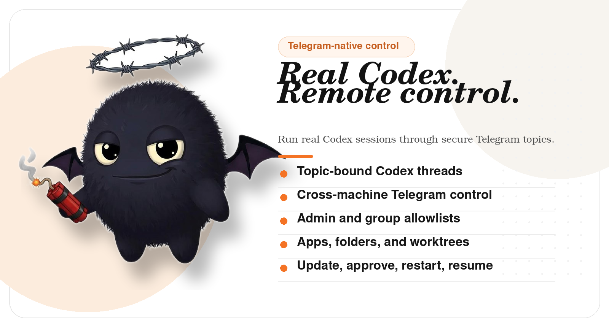

# CoCo: Orchestrate Codex across machines through Telegram.

<p align="center">
  
</p>

<p align="center">
  <strong>Telegram-native control bot for real OpenAI Codex sessions.</strong>
</p>

<p align="center">
  
  
  
</p>

<p align="center">
  <a href="#agent-guided-install-copy-and-paste">Agent-guided install</a> ·
  <a href="#install">Manual install</a> ·
  <a href="#fastest-secure-setup">Setup</a> ·
  <a href="#what-it-actually-does">How It Works</a> ·
  <a href="#faq">FAQ</a> ·
  <a href="#primary-commands">Commands</a> ·
  <a href="#additional-docs">Docs</a> ·
  <a href="CONTRIBUTING.md">Contributing</a>
</p>

## Agent-guided install: copy and paste

This is the easiest way to install CoCo. Start on the machine that will run
CoCo, open Codex in the CLI or desktop app, copy the entire prompt below, and
paste it into Codex. The agent will inspect the machine, perform the local
installation, and pause whenever you need to complete a step in Telegram.

CoCo launches the Codex CLI's `app-server` transport in the background. Opening
the Codex desktop app is a fine place to begin the guided setup, but the target
machine must also have the Codex CLI installed and authenticated before CoCo
can run.

<details>
<summary><strong>Copy this complete CoCo installation prompt</strong></summary>

````text
You are installing CoCo, a Telegram control layer for real OpenAI Codex
sessions, on this machine. Guide me through the entire installation from start
to finish. Perform safe local steps yourself, pause for the Telegram steps only
I can complete, verify every stage, and do not declare success until the final
Telegram test works.

Repository: https://github.com/pcopu/coco

Operating rules:

1. Work on the machine where CoCo will run.
2. Explain each phase briefly before acting, but keep the process moving.
3. Inspect the OS, shell, user, home directory, PATH, service manager, and
   existing Codex/CoCo installations before changing anything.
4. Preserve existing CoCo configuration and state if this is an upgrade. Never
   overwrite working files without showing me what will change.
5. Ask before using sudo, installing system packages, enabling login lingering,
   replacing a service, or making another privileged/system-wide change.
6. Never ask me to paste the Telegram bot token into this Codex conversation.
   Have me enter it in a hidden local terminal prompt so it is not printed or
   stored in shell history. Never print the token in logs or summaries.
7. Use the secure allowlist flow. Do not add the CoCo bot to a group until its
   Telegram user ID and supergroup ID have been written to local configuration.
8. Do not weaken firewall, SSH, Telegram, or filesystem security merely to make
   setup easier.
9. Prefer the official installer. Use a source checkout only when I request it
   or when the installer cannot work.
10. If a command fails, diagnose it and give me the exact next action. Do not
    silently skip a failed requirement.

Phase 1 — Verify Codex on this machine

1. Check whether `codex`, `node`, and `npm` are available and record their
   versions and resolved paths without exposing credentials.
2. If the Codex CLI is missing, install its prerequisite Node.js using the
   appropriate supported method for this OS, then install the official CLI:

   ```bash
   npm install --global @openai/codex
   ```

3. Verify the CLI with `codex --version`.
4. Check authentication with `codex login status`.
5. If it is not authenticated, pause and guide me through `codex login`. On a
   headless or remote machine, offer `codex login --device-auth` if the normal
   browser callback is not practical.
6. Re-run `codex login status`. Do not continue until Codex authentication is
   valid on this machine.

Phase 2 — Install or update CoCo

1. Check whether `coco` is already installed and whether `~/.coco` contains an
   existing configuration. If it does, treat this as an upgrade and preserve
   the configuration.
2. For a normal installation or update, run:

   ```bash
   curl -fsSL https://raw.githubusercontent.com/pcopu/coco/main/install.sh | bash
   ```

3. If the command is not immediately on PATH, refresh the shell command cache
   and add the installer-reported user binary directory to PATH. Do not guess a
   hardcoded path when `command -v coco` can resolve it.
4. Verify the installation with `coco init --help` and record the resolved
   paths for both `coco` and `codex`.
5. Create a sensible project browse root if one does not exist. Default to
   `~/env`, but ask me if I want a different directory.

Phase 3 — Help me create the Telegram bot

Pause while I complete these steps in Telegram. Give me one short checklist at
a time and wait for confirmation after each numbered group.

1. Open `@BotFather` and run `/newbot`.
2. Choose the display name and a unique username ending in `bot`.
3. Save the bot token privately. Tell me not to paste it into this chat.
4. In BotFather, run `/setprivacy`, select the new bot, and choose **Disable**.
   Explain that this lets CoCo receive ordinary messages inside Telegram topics,
   which is the recommended experience. Mention-only/command-only operation can
   be configured later if I deliberately want stricter behavior.
5. In the bot's BotFather settings, enable **Threaded Mode**.

Phase 4 — Create the Telegram supergroup and collect IDs securely

1. Have me create the Telegram group that CoCo will use.
2. In the group settings, enable **Topics**. Telegram will use supergroup/forum
   behavior; this is required because each topic becomes an independent CoCo
   project/session lane.
3. Have me DM `@userinfobot` and copy my numeric Telegram user ID.
4. Before CoCo joins the group, have me temporarily add `@RawDataBot`, send one
   message, and copy the numeric `chat.id` from its reply. Confirm the group ID
   begins with `-100`.
5. Have me remove RawDataBot from the group.
6. Ask me for the numeric user ID and supergroup ID. These are not secrets and
   may be pasted into this conversation. Validate that they are integers and
   that the group ID begins with `-100`.

Phase 5 — Write the secure CoCo configuration

1. Do not ask for the bot token here. Instead, give me a local terminal block
   that reads the token without echo and invokes `coco init`. Fill in the actual
   user ID, group ID, and browse root that we already confirmed. Use this shape:

   ```bash
   read -rsp "Telegram bot token: " COCO_BOT_TOKEN; echo
   coco init \
     --bot-token "$COCO_BOT_TOKEN" \
     --admin-user YOUR_NUMERIC_USER_ID \
     --group-id YOUR_NEGATIVE_100_GROUP_ID \
     --browse-root "$HOME/env"
   unset COCO_BOT_TOKEN
   ```

2. Have me run that block directly in my local terminal, then confirm completion
   without revealing the token.
3. Verify that `~/.coco/.env` and `~/.coco/allowed_users_meta.json` exist, have
   restrictive permissions, and contain the expected user/group IDs. Never
   print the token. If inspecting the env file, redact `TELEGRAM_BOT_TOKEN`.
4. If this machine needs multiple approved groups, repeat `--group-id` during
   initialization or update `ALLOWED_GROUP_IDS` carefully.

Phase 6 — Run CoCo persistently

1. Detect the service manager. On a Linux machine with systemd, create a user
   service named `coco.service` under `~/.config/systemd/user/`.
2. Resolve the absolute `coco` and `codex` binary paths first. Build the service
   with:
   - network-online ordering;
   - `Type=simple`;
   - `WorkingDirectory` set to my home or approved browse root, not an arbitrary
     repository containing a conflicting `.env`;
   - `ExecStart` set to the resolved CoCo executable;
   - `Restart=always` and a short restart delay;
   - `COCO_DIR=%h/.coco` and `PYTHONUNBUFFERED=1`;
   - a PATH that includes the resolved directories containing both `coco` and
     `codex`, plus standard system binary directories;
   - `WantedBy=default.target`.
3. Show me the proposed unit before writing it if an existing unit is present.
4. Run `systemctl --user daemon-reload`, enable and start the service, then
   inspect `systemctl --user status coco.service --no-pager` and recent logs via
   `journalctl --user -u coco.service -n 100 --no-pager`.
5. If I need CoCo to continue after logout, explain user lingering and ask before
   running the privileged command needed to enable it.
6. If this OS does not use systemd, create the equivalent safe per-user service
   using its native service manager. If that cannot be done safely, run `coco`
   in the foreground for the initial test and clearly document the remaining
   persistence step.

Phase 7 — Add CoCo to Telegram and grant only useful permissions

Only begin this phase after the local allowlist is verified and the CoCo process
is healthy.

1. Have me add the new CoCo bot to the approved supergroup.
2. Promote it to administrator so topic/session features work reliably.
3. Enable the permissions needed to post messages, manage topics, delete its
   transient UI messages, and pin/unpin topic messages. Do not grant unrelated
   permissions such as adding administrators or anonymous admin mode.
4. Create or open a normal topic in the supergroup.

Phase 8 — End-to-end verification

1. Have me send `/start` inside the topic.
2. Have me send `/folder`, select this machine and a real project folder, and
   start a fresh session or resume an existing Codex session.
3. Send a harmless test request such as: `Reply with the current workspace path
   and do not modify files.`
4. Confirm the response appears in the same Telegram topic.
5. Run `/status` and confirm the machine, folder, Codex session, model, and
   reasoning information are sensible.
6. Confirm that another topic can be used as a separate project lane if desired.
7. Re-check the service and logs for authentication, permission, polling,
   app-server, or Telegram errors.

Completion report

When everything works, give me a concise report containing:

- OS and service manager
- Codex CLI version and authentication status (never credentials)
- CoCo version/install method and executable path
- CoCo service status
- approved Telegram user ID and supergroup ID
- configuration and state paths
- browse root
- successful Telegram test topic
- how to view logs
- how to update from Telegram with `/update`
- any optional hardening or multi-machine work not yet configured

Do not restart a working service merely to produce the report. Do not claim the
installation is complete until the Telegram request receives a Codex response.
````

</details>

### What you need before starting

- Access to the machine that will stay online and run CoCo
- A Telegram account allowed to create a bot and manage a group
- A ChatGPT/Codex account or OpenAI API key for Codex authentication
- Permission to install user-level software on the target machine

The guided prompt defaults to a secure single-machine setup. After that works,
see [Multi-machine setup](doc/multi-machine-setup.md) to add private worker
machines over Tailscale.

## Install

Copy, paste, run:

```bash
curl -fsSL https://raw.githubusercontent.com/pcopu/coco/main/install.sh | bash
```

Then start CoCo:

```bash
coco
```

## Fastest Secure Setup

Do **not** add the CoCo bot to a group before the allowlist is on the machine.
The secure default is: collect the IDs first, write the config locally, then
invite the bot only after CoCo is locked to the right admin user and
supergroup.

### 1. Create the Telegram bot in BotFather

In Telegram, talk to [@BotFather](https://t.me/BotFather):

1. Run `/newbot` and copy the bot token.
2. Run `/setprivacy` and choose **Disable** so CoCo can read normal topic messages during setup and in any group where you want free-form topic chat.
3. Open **Bot Settings** and enable **Threaded Mode**.
4. After setup is complete, go back to `/setprivacy` and choose **Enable** if you want the stricter default where CoCo only sees commands, replies, and `@mentions`. Leave privacy **Disable** only if you want CoCo to keep reading normal topic messages.

### 2. Create the target supergroup and turn on topics

1. Create the supergroup where CoCo will operate.
2. In the group settings, enable **Topics**.

### 3. Collect the IDs before CoCo ever joins the group

1. DM [@userinfobot](https://t.me/userinfobot) and copy your numeric Telegram user ID.
2. Add [@RawDataBot](https://t.me/RawDataBot) to the target supergroup temporarily.
3. Send one message in the supergroup.
4. Copy the `chat.id` value from RawDataBot's reply. It should start with `-100`.
5. Remove RawDataBot from the supergroup.

### 4. Bootstrap CoCo on the machine

Run this on the machine where CoCo will run:

```bash
coco init \
  --bot-token 123456:ABCDEF_your_bot_token \
  --admin-user 123456789 \
  --group-id -1001234567890
```

Notes:

- Repeat `--group-id` to pre-approve multiple supergroups.
- `coco init` writes `~/.coco/.env` and `~/.coco/allowed_users_meta.json`.
- By default it requires `--group-id` so you do not accidentally start with an open group policy.

### 5. Start CoCo and add it to the approved supergroup

```bash
coco
```

Then:

1. Add your CoCo bot to the approved supergroup.
2. Promote it to admin.
3. Open a topic and send `/start` or `/folder`.

## Hardened Setup

If you want the token, allowlist, and approved groups in root-managed files
instead of `~/.coco/.env`, use the hardened bootstrap path:

```bash
sudo "$(command -v coco-admin)" bootstrap \
  --bot-token 123456:ABCDEF_your_bot_token \
  --admin-user 123456789 \
  --group-id -1001234567890
```

That writes:

- auth users to `/etc/coco/auth/auth.env`
- allowlist metadata to `/etc/coco/auth/allowed_users_meta.json`
- runtime env to `/etc/coco/coco.env`

After that, restart your CoCo service or launch `coco` with that env loaded.

## Source Install

If you prefer source installs:

```bash
git clone https://github.com/pcopu/coco.git
cd coco
uv sync
uv run coco
```

[中文文档](README_CN.md)

CoCo is a Telegram-native control bot for real Codex sessions. It binds
Telegram topics to actual Codex threads, preserves session continuity, and lets
you run, monitor, resume, and steer work away from the terminal without
inventing a fake parallel agent.

CoCo started from `ccbot`, then was rewritten into a cleaner Codex-only
overlay with app-server transport, topic-bound workflows, and CoCo-specific
runtime conventions.

## Credit

CoCo is derived from `ccbot`, which established the original Telegram
topic-to-session operating model this project builds on. The current repo keeps
that lineage while narrowing the scope to a Codex-first overlay.

## What It Actually Does

### 1. Per-topic app layer

Each Telegram topic can have its own little stack of behavior.

- Built-in app flow like `looper`
- Topic-specific skill injection
- Custom app-ish helpers from local `SKILL.md` folders
- A decent place to put the weird project glue you keep reusing

### 2. Git worktrees without turning your repo into soup

CoCo can create and manage worktrees from Telegram so you can branch off work
cleanly instead of shoving every experiment into one checkout and hoping for the
best.

### 3. Multi-machine orchestration over Tailscale

One Telegram-facing controller can route work to multiple machines.

- machine-aware `/folder`, `/resume`, and `/status`
- controller/agent split
- remote session resume and attachment relay
- stale-node peer probing before a machine is declared offline

See [doc/multi-machine-setup.md](doc/multi-machine-setup.md).

### 4. New projects on the fly, organized by Telegram topics

Telegram topics are the project switchboard.

- pick a machine
- pick a folder
- resume an old Codex session or start fresh
- keep each project in its own topic instead of one giant chat graveyard

### 5. Two-way resume using Codex's built-in resume

CoCo binds topics to real Codex threads and leans on Codex's own resume model.
That means you can move between Telegram and the host session without inventing a
fake parallel memory system.

## Why Use It

Because Codex does not stop existing when you leave your desk.

CoCo gives you:

- Telegram topics as project lanes
- queueing, approvals, status, and resume controls
- attachments back into Telegram
- worktree creation and session rebinding
- a practical way to keep multiple projects moving without babysitting one terminal

## Quick Start

### Manual config fallback

If you do not want to use `coco init`, create `~/.coco/.env` yourself:

```ini
TELEGRAM_BOT_TOKEN=your_bot_token_here
ALLOWED_USERS=your_telegram_user_id
ALLOWED_GROUP_IDS=-100your_supergroup_id
```

## FAQ

### Is CoCo a separate AI assistant?

No. CoCo is the Telegram control layer for real Codex sessions. It binds
Telegram topics to actual Codex threads instead of inventing a second memory
system.

### Do I need to add the bot to a group before setup?

No. The safer flow is to create the bot, collect your user/group IDs, run
`coco init`, and only then add the bot to the approved supergroup.

### Does CoCo work across multiple machines?

Yes. One controller can stay Telegram-facing while agent machines sit behind
Tailscale. Folder picking, resume, status, and offline notices all work across
that model.

### Can I update CoCo and Codex separately?

Yes. `/update` supports CoCo-only, Codex-only, or combined updates.

### Where does state live?

By default under `~/.coco`, with Codex session state continuing to live in
`~/.codex/sessions`.

## Additional Docs

- [System architecture](doc/architecture.md)
- [Topic architecture](doc/topic-architecture.md)
- [Message handling](doc/message-handling.md)
- [Multi-machine setup](doc/multi-machine-setup.md)
- [Telegram bot feature matrix](doc/telegram-bot-features.md)

## Primary Commands

| Command | What it does |
| --- | --- |
| `/folder` | Pick machine, folder, and prior session for this topic |
| `/resume` | Rebind this topic to an existing Codex thread |
| `/worktree` | Create/list/fold git worktrees |
| `/apps` | Configure per-topic apps and app-like helpers |
| `/looper` | Run recurring plan nudges until the work is actually done |
| `/q <text>` | Queue the next prompt behind the active run |
| `/status` | Show machine/session state |
| `/model` | Pick per-topic model and reasoning level |
| `/approvals` | Change approval mode for the bound session |

Assistant commands like `/clear`, `/compact`, `/cost`, and `/help` are forwarded to Codex.

## Shell and Agent CLI

The Telegram slash surface is mirrored by a local CLI so agents and cron jobs
can inspect or act on the currently bound topic without clicking through
Telegram UI.

Inspect the current topic:

```bash
coco topic
coco topic --json
```

Send directly to the bound topic from shell:

```bash
coco topic send --text "hello"
coco topic send --text-file /tmp/msg.md
coco topic send --text-file /tmp/msg.md --image-url https://example.com/image.jpg
coco topic send --text-file /tmp/msg.md --image-file /tmp/image.jpg
```

Notes:

- `coco topic send` requires exactly one of `--text` or `--text-file`.
- It accepts at most one image source via `--image-url` or `--image-file`.
- Text-only sends use the normal Telegram text path. Image sends are delivered as
  one photo with the text as the caption.

Drive recurring shell workflows through looper when needed:

```bash
coco looper start plans/ship.md done --every 15m
coco looper start --runner "python tools/nudge.py" --every-random 25m 75m --on-reply
```

Runner mode contract:

- exit `0` with empty stdout: no message is sent
- exit `0` with text on stdout: that text is sent to the topic
- exit nonzero: the failure is logged and the looper stays alive

## Multi-Machine Notes

The controller is the only Telegram-facing process.
Agents stay private on Tailscale.

That gives you:

- one bot identity
- multiple machines in the folder picker
- offline/recovery notices for bound topics
- remote attachment delivery (`.pdf`, `.txt`, `.md`, and common image types)
- a cleaner security model than pretending Telegram is an RPC bus

## Storage

Current default paths:

- config/state: `~/.coco`
- topic bindings: `$COCO_DIR/state.json`
- monitor offsets: `$COCO_DIR/monitor_state.json`
- node registry: `$COCO_DIR/nodes.json`
- Codex sessions: `~/.codex/sessions`

## Admin

```bash
sudo coco-admin show
sudo coco-admin add-user 123456789 --scope create_sessions --admin
sudo coco-admin remove-user 123456789
```

## Current Limits

Still intentionally not done:

- automatic controller failover/failback
- generic cross-machine monitor jobs
- project folder sync / handoff
